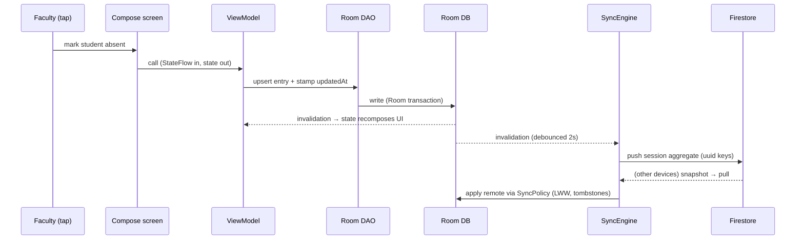

# ACADORA — Architecture Diagram

> Companion to §4 (Architecture) of `ACADORA_PROJECT_REPORT.md` and Slide 6 of
> `ACADORA_PRESENTATION_DECK.md`. The diagram below is **Mermaid** — GitHub renders it
> automatically; for slides, paste it into [mermaid.live](https://mermaid.live) and export PNG.

## 1. Layers & data flow

```mermaid
flowchart TB
    subgraph UI["🖥️ UI LAYER — ui/ (Jetpack Compose)"]
        direction LR
        SCREENS["Compose screens<br/>home · timetable · attendance · students<br/>notes · events · AI · calendar · settings"]
        VMs["ViewModels<br/>StateFlow per feature"]
        DS["Design system<br/>theme tokens · glass · motion · components"]
        SCREENS --> VMs
        DS -.->|styles every screen| SCREENS
    end

    subgraph DOMAIN["⚙️ DOMAIN LAYER — domain/ (pure Kotlin, unit-testable)"]
        direction LR
        ASSISTANT["FacultyAssistant<br/>local AI engine"]
        PARSERS["Parsers & rules<br/>Excel · money · dates"]
    end

    subgraph DATA["💾 DATA LAYER — data/"]
        direction LR
        AUTH["auth/<br/>AuthRepository<br/>single owner of auth state"]
        DAO["local/<br/>Room DAOs · 17 entities<br/>guarded migrations v1→v9"]
        ROOM[("Room database<br/>SOURCE OF TRUTH")]
        MEDIA["attachments/<br/>SAF copy · MIME · compress"]
        PREFS["prefs/<br/>DataStore"]
        DAO <--> ROOM
        MEDIA -.->|files| ROOM
    end

    subgraph SYNC["☁️ SYNC LAYER — data/sync/ (the ONLY Firestore caller)"]
        direction LR
        POLICY["SyncPolicy<br/>pure math: LWW · watermarks · tombstones"]
        ENGINE["SyncEngine<br/>push (2s debounce) · pull · converge"]
        POLICY --> ENGINE
    end

    FB[("🔥 FIREBASE<br/>Auth · Firestore<br/>users/&#123;uid&#125;/slots · students · sessions · tombstones")]
    NOTIF["notifications/<br/>AlarmManager · receiver"]
    WIDGET["widget/<br/>home-screen widgets"]

    VMs -->|"reads/writes via DAO"| DAO
    VMs -->|"questions"| ASSISTANT
    ASSISTANT -->|"queries real data, cites sources"| DAO
    VMs --> PARSERS
    AUTH --> ROOM
    ROOM -->|"invalidation"| ENGINE
    ENGINE <-->|"last-write-wins · tombstones · uuid keys"| FB
    AUTH <-->|"sign-in state gates sync"| ENGINE
    ROOM -.->|"observe"| WIDGET
    ROOM -.->|"schedule"| NOTIF
```

## 2. The write path (tap → cloud, in one picture)

## 3. Rules the diagram encodes

1. **One-way dependencies** — UI → Domain/Data; nothing in `domain/` imports Android or Firebase.
2. **Room is the source of truth** — every feature reads and writes Room; Firestore is the
   account's cloud mirror, never the app's database.
3. **SyncEngine is the single Firestore caller** — all cloud I/O funnels through one owner,
   gated by AuthRepository's sign-in state.
4. **SyncPolicy is pure math** — conflict verdicts and watermark rules are unit-testable
   without a device (12 dedicated tests).
5. **Everything works with Firebase removed** — widgets, notifications, and the AI assistant
   hang off Room, which is why the app is fully functional offline.
